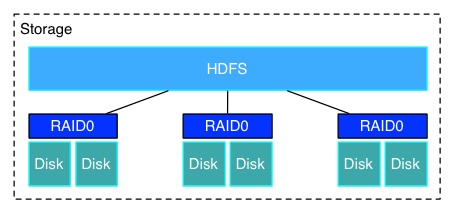

## Stage 0 : 一切的开始
小徐是一个很勤快刻苦的大数据工程师，与此同时当然也是一个十分受业界欢迎和抢手的工程师，今天，是他受邀来到“菊花街”上班的第一天，领导就让小徐开始设计一个大数据系统——JH-BigDataPlatform。小徐感受到了扑面而来的荣耀和满满的动力，但作为一个有经验的工程师，他并没有立刻开始实际的设计和实现工作，而是开始了需求分析。通过和领导的邮件沟通，他暂时收到了这样的需求：
> *	系统要能够对海量数据进行分析，比如查询、计算或者运行机器学习算法之类的
> *	系统要能够存储5T以上的数据，并且在需要的时候能够在不影响系统运行的情况下进行扩容
> * 系统计算速度应该足够快，在必要的时候应该能够在不影响系统运行的情况下对计算能力进行扩展
> *	由于使用系统的除了程序员还有一帮做业务的是一群不会编码的萌妹子，只会写写简单的SQL，所以系统还要对她们足够友好
> *	系统要7 * 24小时稳定运行，由于“菊花街”没钱，买不起高级服务器租不起超级牛逼的机房，但就算这样也要保证在一两台服务器抽风的情况下系统也能足够坚挺
> *	小徐的系统十分重要，全公司的数据分析业务都将运行在小徐的系统上，所以系统要能够对这一大堆业务应用进行管理
> *	业务运行在系统上不知道死活，领导看着很不放心，所以小徐的系统还需要能够让领导随时看看服务器的状态好不好呀，业务运行到哪部分啦，有多少业务已经运行啦之类的数据安安心

虽然需求列表上说的看起来很厉害的样子，但当经验丰富的小徐看到这封邮件之后，只是伸了伸懒腰，然后嘴角上扬，露出了轻蔑的微笑。然而他并不知道，他未来设计道路上最大的敌人——他的产品经理小杨，在他背后角落的阴影里，默默地注视着他，轻轻地扶了扶眼镜……

## Stage 1 : 
小徐信心满满，准备立即开始大干一场。他首先要来了服务器的信息：
> * CPU Intel(R) Xeon(R) CPU E5-2620 v2 @ 2.10GHz / 24核
> *	内存64G每台
> *	硬盘2T * 2
> * 3台相同配置的服务器

小徐看到这份清单后长嘘一口气：还好每台服务器的配置都是一样的，那么后面的设计就简单多了。

在小徐心里，一个系统的存储部分永远都是它的基础，无论再怎么牛逼的应用都离不开稳定高效的存储系统，所以小徐决定，他的设计从这一部分开始……

首先是硬盘部分，还是因为“菊花街”真的很穷，手头上的硬盘满打满算也只有12T的容量，却要保证5T的有效存储负荷，而且还必须使系统具有容错能力，那么该怎么办呢？经验丰富的小徐想到了两个方案：

1.	利用RAID技术对数据进行备份
2.	利用分布式文件系统的方式进行容错

首先评估一下方案1：RAID技术翻译过来叫做磁盘阵列技术，它能够将多个廉价的硬盘组合在一起形成一个磁盘组，以此来提升存储效能和存储容量。这种技术十分成熟，应用范围也十分广泛，通常的服务器自身就在硬件上提供了RAID服务（内置RAID卡），并且能够根据不同的使用情景选择RAID0、RAID1、RAID5来着重加强某一方面的能力，从里到外透着一股技术的厚重感……

然后是方案2所说得分布式文件系统。分布式文件系统能够将网络上不同服务器的存储资源有机的组合在一起，并且提供一个访问的接口。与此同时，分布式文件系统也同样能够利用数据副本、linage等方式对数据进行保护。

小徐生在新中国长在红旗下，深受马克思唯物主义辩证思想熏陶足足二十载，立即就决定了使用方案3，即方案1和方案2的结合。首先，小徐在每台服务器上将两块硬盘组成了RAID0，使数据读写时能够达到并发的效果，在大负载数据读写情境下能达到接近单硬盘两倍的性能；然后，再通过分布式文件系统将三台服务器串联在一起，为分布式文件系统配置副本数为2，即所有数据都会同时存在两份，分别分布在两台不同的服务器上，那么即使有一台服务器出了问题，这个时候还是有一台服务器上的数据能够访问得到。

在这样的设计中，小徐利用有限的资源，为使用方提供了5T以上的稳定存储服务，并且还有多出来的存储空间可以用来方日志、应用、操作系统工具等等其他的东西，一切都是那么游刃有余。

最后，关于分布式文件系统的选择上，小徐摸了摸满是胡渣的下巴，心想这个还用得着想吗，又没有什么特殊的要求，HDFS都已经统一大半个江湖了，就它好了，出了问题也容易找到帮助。

就这样，小徐大笔一挥，做出了第一个设计决策：存储系统 = RAID0 + HDFS。此时，系统看起来是这个样子的：

小徐很得意，一切都是那么顺利，连那个老员工传说中最会折磨人的产品经理小杨也没有来找麻烦。而此时此刻，小杨正坐在他自己的办公室里，恶补着一切大数据云计算知识，准备教教这个新来的小朋友，什么叫程序员最大的敌人。

一片乌云正缓缓向小徐头顶上接近，飘得不快，却势不可挡……